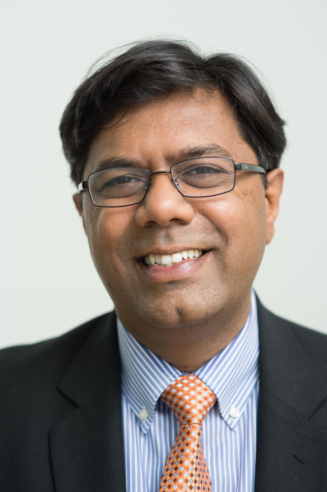
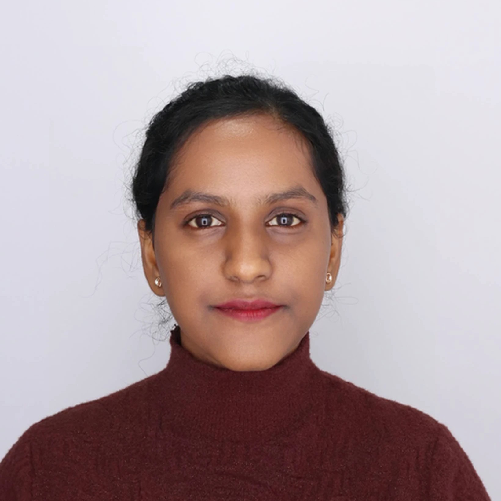
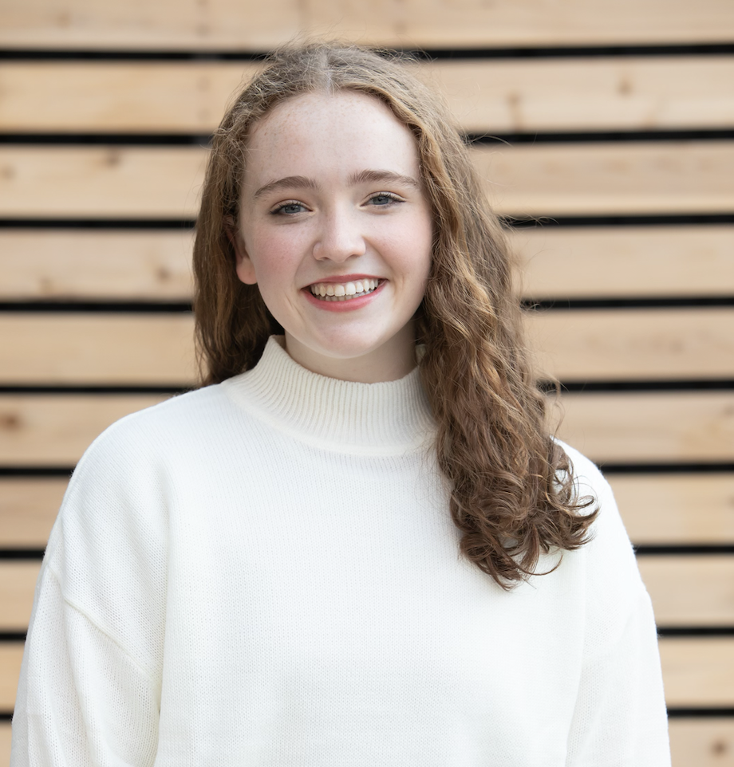
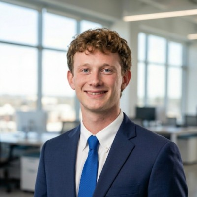

<html>
<head>
    
</head>
<body>
---

:::{.callout-important}
**Referencing the content in this webpage:**

Bulusu, Kartik V. (2026, October 09). Introduction to Mechanical and Aerospace Engineering [Course lecture notes, codes and presentations]. Department of Mechanical and Aerospace Engineering, The George Washington University.
:::

## Dr. Kartik Bulusu (Instructor)
<table>
  <tr>
    <td width="70%">
      
      Dr. Kartik V. Bulusu is an Associate Research Professor in the Department of Mechanical and Aerospace Engineering at The George Washington University, Washington DC. 
      
      He curated a cross-disciplinary course titled, Internet of Things (IoT) and Edge Computing with applications in cyber-physical systems and speech processing. 
      
      In addition, he developed courses for first year engineering students on the engineering applications of Raspberry Pi, Python programming and mobile App development inspired by social innovation potential during the COVID-19 pandemic. 
      
      His research interests span the areas of human health and sustainable energy with a focus on mechanics of biological fluids, low-cost energy technologies and applications of wavelet transforms. His current research work on biofluid dynamics of the cardiovasculature, rheology of biological fluids and applications of wavelet transforms has been supported by NSF and the Center for Biomimetics and Bioinspired Engineering (CBBE), GWU.  
      
      He developed a wavelet transform-based computational code (PIVlet) for the analysis of complex vortical patterns encountered in arterial blood flow. He has extensive knowledge of experimental fluid mechanics and non-invasive measurement techniques such as laser Doppler velocimetry (LDV), particle image velocimetry (PIV), schlieren imagery, magnetic resonance velocimetry (MRV) and molecular tagging velocimetry (MTV). Dr. Bulusu was recognized with the ASME Best Paper Award by the Advanced Energy Systems Division (AESD) Heat Pump Technical Committee, William and Louise Corcoron Award for contributing to the intellectual and social life and the Bender award for teaching excellence in the School of Engineering and Applied Science, GWU.
    </td>

    <td width="30%">
      
      <!-- <small>Dr. Kartik Bulusu</small>  -->
      **Campus Address:** SEH 4615 

      **Email:** bulusu at email dot gwu dot edu
    </td>
  </tr>
</table>

## ​Preethi Siva Kumar (Graduate Instructional Assistant)
<table>
  <tr>
    <td width="60%">
I am ​Preethi Siva Kumar, graduate student in the Department of Mechanical and Aerospace Engineering. My research focuses on computational fluid dynamics, and I am currently working with Dr. Kartik Bulusu in the Biofluid Dynamics Lab. My work explores cardiovascular flow and the physiological effects of blood rheology.

​Before beginning my graduate studies, I earned my undergraduate degree in Aeronautical Engineering and gained practical experience in aerodynamics and controls by competing in competitions like SAE Aero Design and AIAA Design/Build/Fly. I am experienced as a software developer where I worked with JavaScript and Python.

​When I am not in the lab, I enjoy visiting museums and working hard to keep myhouseplants alive. I am looking for name suggestions for my new cactus, so feel free to share your ideas at my email below!
</td>

    <td width="40%">
      

      <!-- <small>Dr. Kartik Bulusu</small>  -->
      **Office hours and Location:** TBA 

      **Email:** preethis at gwu dot edu

      [**LinkedIn**](https://www.linkedin.com/in/sivakumarpreethi/)
    </td>
  </tr>
</table> 

## Anya Spevacek (Learning Assistant)
<table>
  <tr>
    <td width="60%">
      I am a senior in mechanical engineering with a pre-medicine concentration from Chicago, IL! Through my time at GW, I have developed a deep passion for engineering solutions that improve patient care and outcomes. I have gained experience in outpatient clinical settings and am currently working on a heart surgery device.

      This past summer, I gained valuable experience collaborating with physicians to apply engineering principles to medical problems through CAD, 3D printing, and testing. I have also worked in research labs at Children’s National Hospital and am currently developing a soft robotic device for my capstone project. I have found a deep passion for research because I enjoy solving new problems and developing solutions along the way!

      At GW, I am a member of the GW Rocket Team, a SEAS SPAN mentor, and the president of GW Irish Dance. Outside of school, I love exploring DC and discovering new places. I am excited to continue working in medical R&D and improving patient care!
    </td>
    <td width="40%">
      
      <!-- <small>Dr. Kartik Bulusu</small>  -->

      **Office hours and Location:** TBA 

      **Email:** anya dot spevacek at gwu dot edu

      [**LinkedIn**](https://www.linkedin.com/in/anya-spevacek/)
    </td>
  </tr>
</table>

## Toby Pike (Learning Assistant)
<table>
  <tr>
    <td width="60%">
       I am Toby Pike, a junior here at GW studying Mechanical Engineering with a concentration in aerospace. Currently, I am working as an undergraduate research fellow under Professor Bulusu in his biofluid dynamics laboratory, where I focus mainly on cardiovascular flow experiments and rheology work testing complex fluids. This winter, I will be interning at the NUWC in Newport, working on towed arrays for naval submarines. I am also a member of the Theta Tau engineering fraternity here on campus, as well as a member of the GW men's club basketball team. Outside of the professional and academic space, I love watching soccer (I’m a big Premier League fan) and basketball, and I am getting into cooking as well. I am very excited to assist with this class.
    </td>
    <td width="40%">
      
      <!-- <small>Dr. Kartik Bulusu</small>  -->

      **Office hours and Location:** TBA 

      **Email:** toby dot pike at gwu dot edu

      [**LinkedIn**](https://www.linkedin.com/in/toby-pike-245064312/)
    </td>
  </tr>
</table>

## Ergi Agaj (Learning Assistant)
<table>
  <tr>
    <td width="60%">
      Short bio will be released soon ..       
    </td>
    <td width="40%">
      
      <!-- <small>Dr. Kartik Bulusu</small>  -->

      **Office hours and Location:** TBA 

      **Email:** ergi dot agaj at gwmail dot gwu dot edu

      [**LinkedIn**](https://www.linkedin.com/in/ergiagaj/)
    </td>
  </tr>
</table>

<!-- 
### Instructor contacts

Campus Address: SEH 3640

E-mail: bulusu at gwu dot edu

Office hours: On-demand (please reach out via email or Slack!)

Location: Blackboard Collaborate Course Room
 -->

<!--   
<footer>
  
<small><small><small><small>This is a Quarto website. To learn more about Quarto websites visit <https://quarto.org/docs/websites>. 
  Author: Kartik Bulusu 
  Contact: <a href="mailto:bulusu@gwu.edu">bulusu</a> 
  &copy; 2024 All rights reserved</small></small></small></small>

</footer> -->